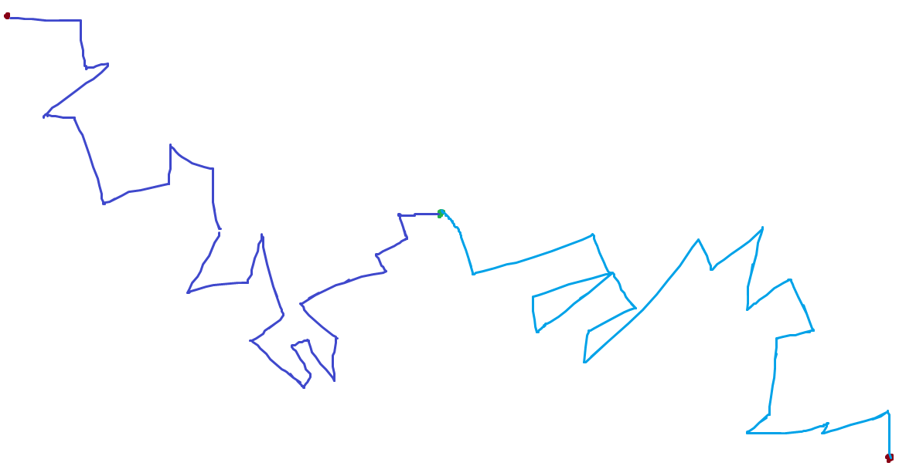

# Las Causas
## Descripción
El objetivo de este proyecto es visualizar el proceso de caminatas aleatorias. Se hace referencia al poema de Borges, "Las Causas" que habla de todas las cosas que deben haber pasado para que suceda algo. A veces no lo vemos así, pero la realización de un evento depende de muchos eventos que han pasado anteriormente. 

## Objetivo
El objetivo de este proyecto es visualizar el proceso de caminatas aleatorias. Se busca mostrar cómo se generan caminatas aleatorias para que el concepto quede más claro para el usuario. Y aparece el poema de Borges en medio para que se aprecie la parte artística del proyecto.

## Interpretación
A pesar de tener dos caminatas aleatorias, al final, ambas caminatas se encuentran, y el poema termina con la frase de "Se precisaron todas esas cosas para que nuestras manos se encontraran", entonces, es esta idea de que no vamos en un camuino recto, pasan muchas cosas que parecieran desviarnos, parecieran cambiar nuestro rumbo, pero es la combinación de todas esas cosas que nos llevan a un punto en específico.
En este caso, a las manos de nuestr@ amad@ <3

## Visión inicial
Lo que se desea es obtener algo así:
